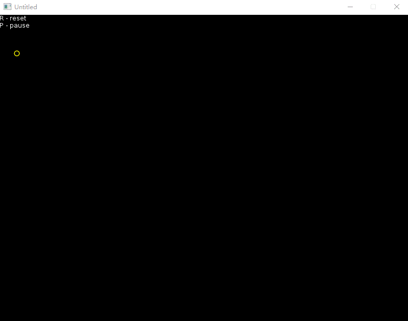

# Projectile Interception

Intercept any moving object if both the moving object and the object going to launch has the same acceleration (e.g. same gravity).

You need [LÖVE](http://love2d.org/) 0.10.x to run this.
See https://love2d.org/wiki/Getting_Started -> Running Games

